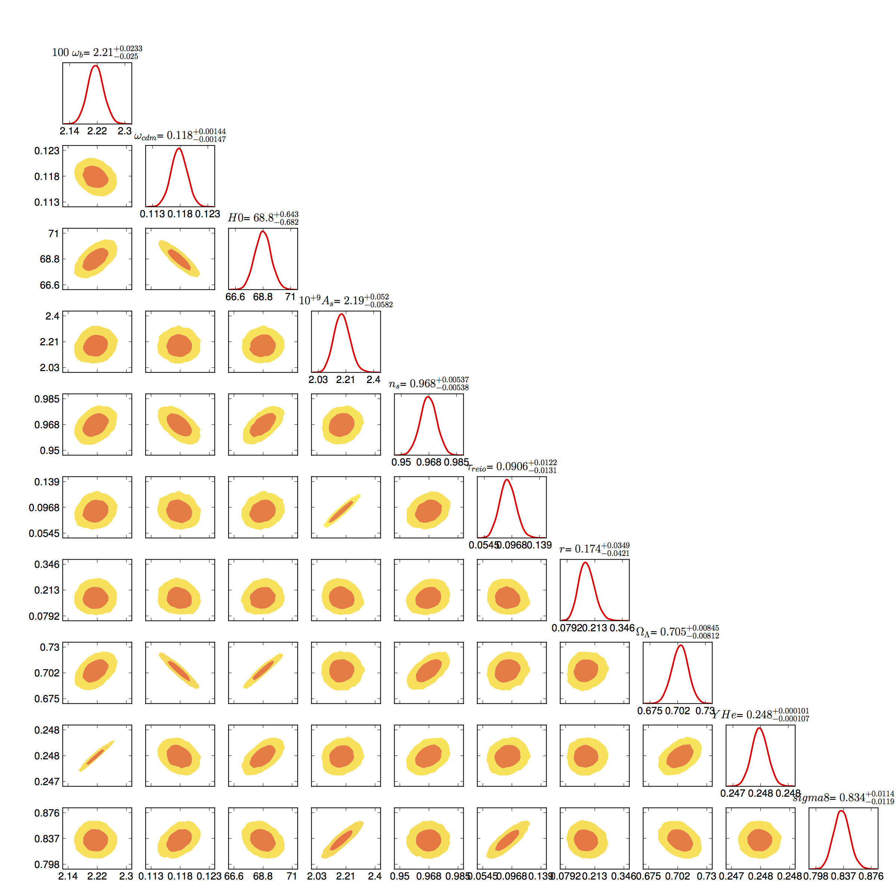

Cosmological Markov Chain Monte Carlo Data
------------------------------------------

We thank the Institutional Computing Program at Los Alamos National Laboratory for providing the computing resources used to generate this data.

If this data is used in a publication, please cite the following:

D Blas, J Lesgourgues, and T Tram "The cosmic linear anisotropy solving system (CLASS). part II: approximation schemes.", Journal of Cosmology and Astroparticle Physics 2011 (07), 034 http://dx.doi.org/10.1088/1475-7516/2011/07/034

Audren, Benjamin, Julien Lesgourgues, Karim Benabed, and Simon Prunet. “Conservative Constraints on Early Cosmology: An Illustration of the Monte Python Cosmological Parameter Inference Code.” Journal of Cosmology and Astroparticle Physics 2013 http://dx.doi.org/10.1088/1475-7516/2013/02/001

Warren, Michael S. (2014): Cosmological Markov Chains. figshare. 
http://dx.doi.org/10.6084/m9.figshare.994210

Model a2_bao14 is based on the following observational data:

Planck_highl, Planck_lowl, lowlike, bao_boss14, bicep2

Anderson, Lauren, Eric Aubourg, Stephen Bailey, Florian Beutler, Vaishali Bhardwaj, Michael Blanton, Adam S. Bolton, et al. “The Clustering of Galaxies in the SDSS-III Baryon Oscillation Spectroscopic Survey: Baryon Acoustic Oscillations in the Data Release 10 and 11 Galaxy Samples.” arXiv:1312.4877 [astro-Ph], December 17, 2013. http://arxiv.org/abs/1312.4877.

Bennett, C. L., D. Larson, J. L. Weiland, N. Jarosik, G. Hinshaw, N. Odegard, K. M. Smith, et al. “Nine-Year Wilkinson Microwave Anisotropy Probe (WMAP) Observations: Final Maps and Results.” arXiv:1212.5225 [astro-Ph], December 20, 2012. http://arxiv.org/abs/1212.5225.

Beutler, Florian, Chris Blake, Matthew Colless, D. Heath Jones, Lister Staveley-Smith, Lachlan Campbell, Quentin Parker, Will Saunders, and Fred Watson. “The 6dF Galaxy Survey: Baryon Acoustic Oscillations and the Local Hubble Constant.” arXiv:1106.3366 [astro-Ph], June 16, 2011. http://arxiv.org/abs/1106.3366.

BICEP2 Collaboration, P. A. R. Ade, R. W. Aikin, D. Barkats, S. J. Benton, C. A. Bischoff, J. J. Bock, et al. “BICEP2 I: Detection Of B-Mode Polarization at Degree Angular Scales.” arXiv:1403.3985 [astro-Ph, Physics:gr-Qc, Physics:hep-Ph, Physics:hep-Th], March 16, 2014. http://arxiv.org/abs/1403.3985.

Delubac, Timothée, Julian E. Bautista, Nicolás G. Busca, James Rich, David Kirkby, Stephen Bailey, Andreu Font-Ribera, et al. “Baryon Acoustic Oscillations in the Ly{\alpha} Forest of BOSS DR11 Quasars.” arXiv:1404.1801 [astro-Ph], April 7, 2014. http://arxiv.org/abs/1404.1801.

Planck Collaboration, P. A. R. Ade, N. Aghanim, C. Armitage-Caplan, M. Arnaud, M. Ashdown, F. Atrio-Barandela, et al. “Planck 2013 Results. I. Overview of Products and Scientific Results.” arXiv:1303.5062 [astro-Ph], March 20, 2013. http://arxiv.org/abs/1303.5062.

